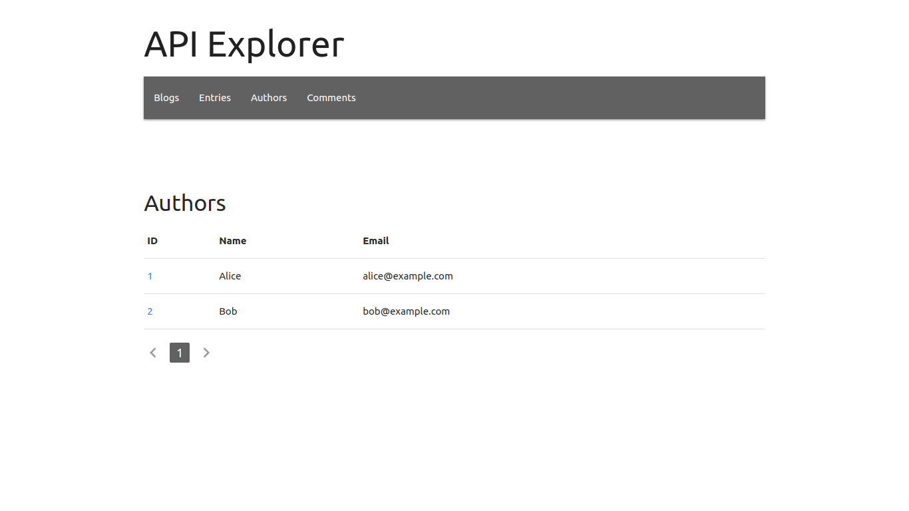
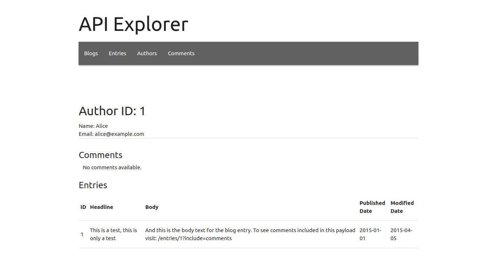

Deploying the application locally
---------------------------------

* Clone the repository.
* Make sure you have node(>=8) and npm(>=6) installed.
* Run the command npm install to install all dependencies.
* Run the command npm start to start the development server .
* Go to http://localhost:3000 to access the application.

Improvements
-------------

* Proptypes validations can be improved.
* Create a production build as an npm script.
* Componenents can be further broken in to smaller components.
* Fine-grained error handling with componentDidCatch lifecycle hook.
* UI improvements to detailed view, table and navbar selections etc.

Additional Notes
-----------------

* This project is designed to cater future model additions and CRUD operations.   

Screenshots
------------

